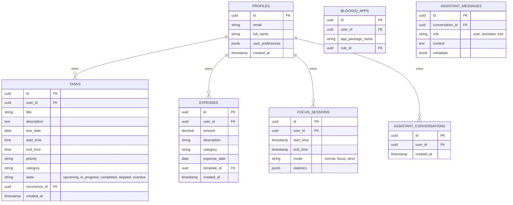

# Database Entity Plan & AI Assistant Architecture

## 1. Database Entity Relationship Plan (Supabase / PostgreSQL)

## 2. AI Assistant Architecture

**Core Principle**: The AI must NOT directly mutate the database. It acts as an orchestrator that determines user intent.

**Architecture Flow**:
1. **User Input**: "I spent 80 on lunch."
2. **AI Intent Parser (Edge Function)**: LLM extracts intent -> `{"action": "create_expense", "payload": {"amount": 80, "description": "lunch", "category": "Food", "date": "today"}}`
3. **Structured Intent**: JSON payload is returned to the client/service layer.
4. **Validation (Zod)**: The application service validates the JSON payload against expected schemas.
5. **Application Service**: Application executes the action using the authenticated user's session.
6. **Database**: Securely mutated via standard API routes / Supabase client, enforcing Row Level Security.
